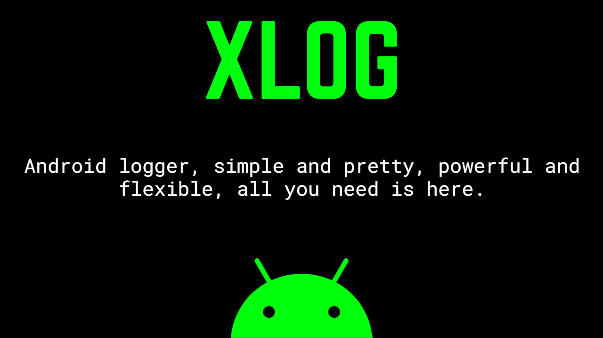
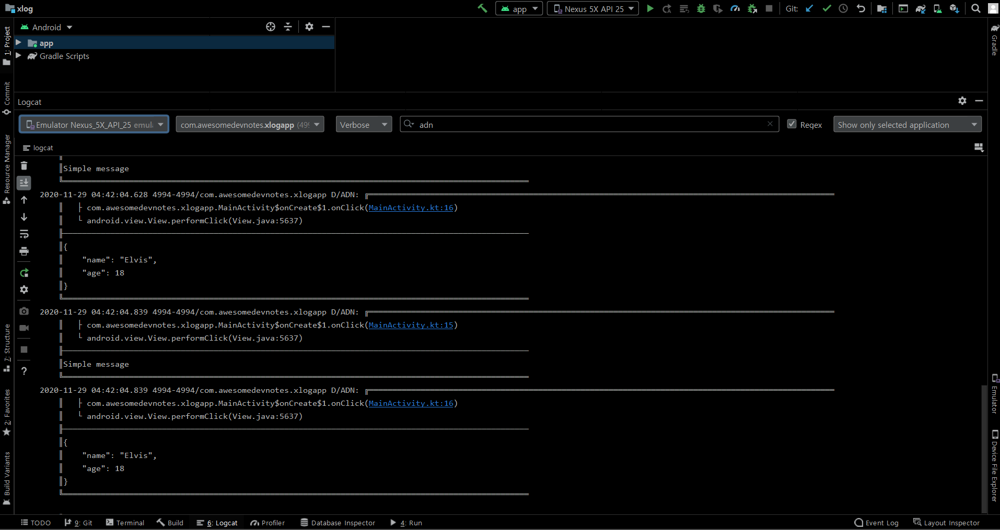

<h1 align="center">XLog</h1> 

Sample app for XLog, an Android Logger.

 

Written Usage Instructions and Library: https://github.com/elvishew/xLog

 

Video Usage Instructions on Awesome Dev Notes YouTube: https://youtu.be/FqEHRviO4YM

 

  
  
  

 

</img>

 

Lightweight and pretty, powerful and flexible logger for android, java and kotlin, can print the log to Logcat, Console and Files, or anywhere if you like.

Library: https://github.com/elvishew/xLog

## Output

 

</img>

 

## :computer: Find us on

	<a href="https://github.com/androiddevnotes"> GitHub </a> / <a href="https://discord.gg/vBnEhuC"> Discord </a> / <a href="https://twitter.com/androiddevnotes"> Twitter </a> / <a href="https://www.instagram.com/androiddevnotes"> Instagram </a> / <a href="https://www.youtube.com/channel/UCQATLaT0xKkSm-KKVQzpu0Q"> YouTube </a> / <a href="https://medium.com/@androiddevnotes"> Medium </a>
	  
    </img>

